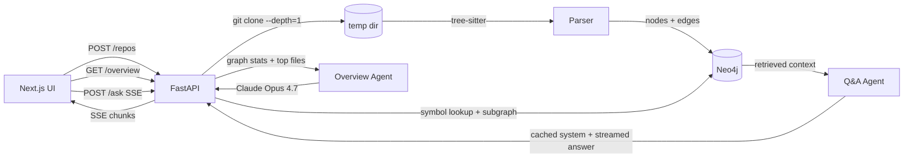

# Codebase Explainer

Paste any public GitHub repo URL. Get a graph-grounded architecture overview and a chat that answers questions about the code with file:line citations.

Built to solve a real onboarding problem: when you join a project or want to contribute to an open source repo, the first day is spent grepping for `main`, tracing imports, and trying to figure out where things live. This tool does that work in 30 seconds.

## Why this is different from "just ask ChatGPT"

LLM chat against a raw repo dump runs out of context immediately and hallucinates symbols that don't exist. This system:

1. **Parses the repo with tree-sitter** — extracts real symbols (functions, classes, methods), real import edges, and best-effort call edges. No keyword grep, no embeddings hallucination.
2. **Stores the code as a Neo4j graph** — `File`, `Symbol` nodes; `IMPORTS`, `CALLS`, `DEFINED_IN` edges. Now Q&A can do graph traversal ("who calls `validate_token`?") instead of fuzzy text search.
3. **Grounds every answer in retrieved subgraphs + snippets** — when you ask "where is auth", the system finds the matching `Symbol`s, pulls their neighborhoods, and feeds *only those* to Claude. The model cites file:line because file:line is what it was given.
4. **Caches the repo context with prompt caching** — every follow-up question reuses the same per-repo system prompt (stats + symbol index) at ~0.1× cost.

## Architecture



## Stack

| Layer       | Tech                                                                |
|-------------|---------------------------------------------------------------------|
| Frontend    | Next.js 14 (App Router) · Tailwind · Mermaid                        |
| Backend     | FastAPI · Anthropic SDK · sse-starlette                             |
| Code parser | Tree-sitter (Python, TS, TSX, JS, JSX, MJS) via language-pack       |
| Graph DB    | Neo4j 5 with property graph schema (`File`, `Symbol`, `IMPORTS`, `CALLS`) |
| Model       | `claude-opus-4-7` with adaptive thinking, structured outputs, prompt caching |

## Run locally

```bash
cp backend/.env.example backend/.env
# fill in ANTHROPIC_API_KEY in backend/.env

docker compose up --build
```

Open **http://localhost:3000**.

Neo4j Browser UI: **http://localhost:7474** (user `neo4j`, pass `password`) — useful for inspecting the graph after you ingest a repo.

## Run without Docker

```bash
# Neo4j: easiest is docker run -e NEO4J_AUTH=neo4j/password -p 7474:7474 -p 7687:7687 neo4j:5.23

# Backend
cd backend
python -m venv .venv && source .venv/bin/activate
pip install -e .
cp .env.example .env  # fill ANTHROPIC_API_KEY
uvicorn explainer.app:app --reload

# Frontend (new terminal)
cd frontend
npm install
npm run dev
```

## API surface

| Method | Path                       | Notes                                                                |
|--------|----------------------------|----------------------------------------------------------------------|
| POST   | `/api/repos`               | Body: `{ "url": "https://github.com/owner/repo" }`. Async ingest.    |
| GET    | `/api/repos/{id}`          | Job status: `pending` → `cloning` → `parsing` → `ingesting` → `ready`. |
| GET    | `/api/repos/{id}/overview` | Returns `{summary, stack, entry_points, key_modules, mermaid, first_questions}`. |
| POST   | `/api/repos/{id}/ask`      | Body: `{ "question": "..." }`. Returns SSE stream of token chunks.   |

## What's in the graph

| Node       | Properties                                                  |
|------------|-------------------------------------------------------------|
| `Repo`     | `id`, `slug`, `ingested_at`                                 |
| `File`     | `repo_id`, `path`, `language`, `bytes`                      |
| `Symbol`   | `repo_id`, `qname`, `name`, `kind` (`class`/`function`/`method`), `file_path`, `line_start`, `line_end`, `snippet` |

| Edge          | From → To             | Notes                                          |
|---------------|-----------------------|------------------------------------------------|
| `IN_REPO`     | `File` → `Repo`       | Membership                                      |
| `DEFINED_IN`  | `Symbol` → `File`     | Where the symbol lives                          |
| `IMPORTS`     | `File` → `File`       | Best-effort resolution via path suffix match    |
| `CALLS`       | `Symbol` → `Symbol`   | Best-effort name-based resolution               |

The "best-effort" parts are intentional — for an MVP, we don't try full type-checker-grade resolution. The graph is dense enough for the Q&A agent to find candidates and the LLM to pick the right one from context. Two competing imports/calls become two retrieved candidates instead of one wrong answer.

## Cost guards

The backend enforces per-repo limits via env:

- `MAX_REPO_FILES=300` — skip the long tail of files
- `MAX_FILE_BYTES=100000` — skip generated / bundled files
- `ALLOWED_EXTENSIONS=py,ts,tsx,js,jsx,mjs` — only what we can parse

`git clone --depth=1 --filter=blob:limit=2m` keeps cloning fast and bounded. Source files are parsed in-process; we tear down the temp dir after ingest.

## Deploy

15-minute, no-credit-card deploy on free tiers (Vercel + Render + Neo4j Aura).
Step-by-step guide with the exact env vars to paste: see **[DEPLOY.md](./DEPLOY.md)**.

## What's next

- Inline source rendering on `/repos/[id]` (split-pane: chat + code)
- Symbol-level deep-link (`/repos/[id]/symbol/[qname]`)
- More languages (Go, Rust, Java) — tree-sitter-language-pack already has them
- Full call-graph resolution with a real type checker (LSP integration?)
- Multi-repo workspaces — answer questions across a microservice cluster
